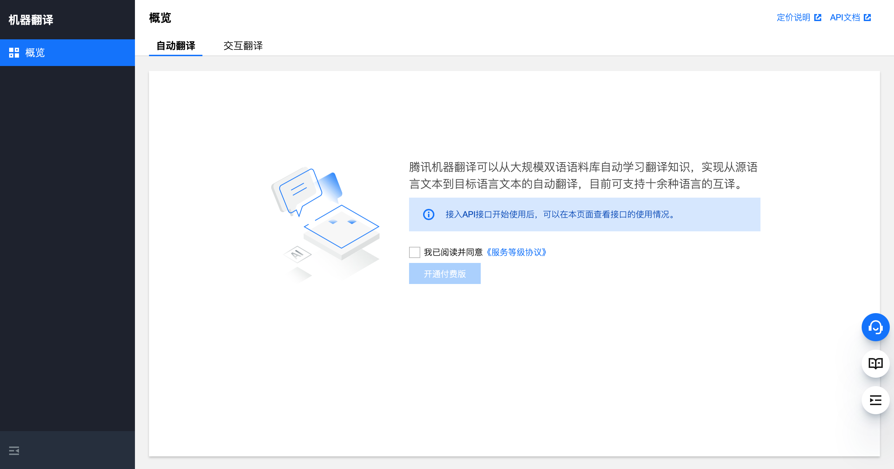
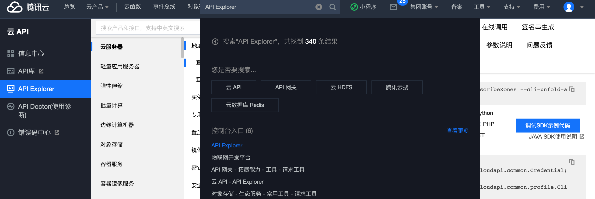
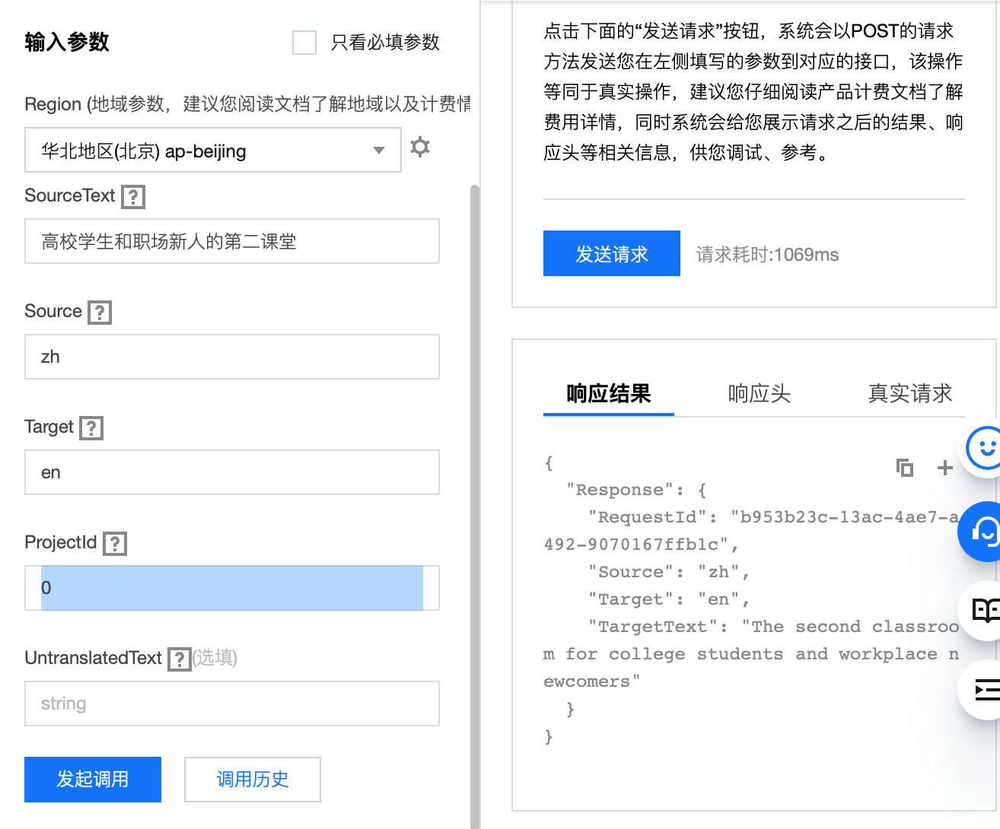

# 使用API操作云服务

在本文中，我们以[腾讯云机器翻译](https://cloud.tencent.com/product/tmt)的[文本翻译API](https://cloud.tencent.com/document/product/551/15619)为例，在控制台的API Explorer操作，讲解如何使用API操作云服务。

## 准备工作：开通机器翻译服务

在机器翻译首页点击“立刻使用”，进入机器翻译控制台。

我们可以看到，此时机器翻译服务还没有开通。



点击开通。开通后的页面为

[开通状态](2_images/service_registered.png)

如果打开就是后者，不需要操作。

## 找到文本翻译API入口

[API Explorer](https://console.cloud.tencent.com/api/explorer?Product=cvm&Version=2017-03-12&Action=DescribeZones&SignVersion=)是云厂商提供的用来直接操作API的控制台工具。

要特别注意，这里操作API会和控制台一样操作云服务，因此要特别小心。

在控制台的搜索框搜索“API Explorer”，点击搜索出来“控制台入口”下的“API Explorer”



在API Explorer的搜索框搜索“文本翻译”，点击搜索结果中的第二个“文本翻译”。

## 操作文本翻译API

在“输入参数”中按顺序填入以下参数：

- `Region`: 云服务所在的地域。由于机器翻译在各个地域没有计费差别，随便选择一个即可，比如“`华北地区（北京）`ap-beijing”。
- `SourceText`: 待翻译的文本。填写你想要翻译的文本。比如“`高校学生和职场新人的第二课堂`”。
- `Source`: 待翻译的语言。这里是中文“`zh`”。
- `Target`: 目标语言。比如我们这里想翻译成英文“`en`”。
- `ProjectId`: 填写“`0`”即可。
- `UntranslatedText`: 选填参数，我们暂时用不着。

点击“发起调用”。如果是这段时间第一次调用，会跳出手机验证码输入验证。



我们可以在响应结果中看到

```json
{
  "Response": {
    "RequestId": "b953b23c-13ac-4ae7-a492-9070167ffb1c",
    "Source": "zh",
    "Target": "en",
    "TargetText": "The second classroom for college students and workplace newcomers"
  }
}
```

“`TargetText`”字段即可以获得我们希望的翻译结果“`The second classroom for college students and workplace newcomers`”。

## 小结：对比使用翻译网站

读者肯定已经发现，这里和[谷歌翻译](https://translate.google.com)、[百度翻译](https://fanyi.baidu.com)等翻译网站提供的功能十分类似。

读者日常使用翻译网站或者翻译APP时，输入待翻译文字、选择待翻译语言（中文）和目标语言（英文），点击运行，获取结果。我们使用云API时，输入API参数，点击运行，获取结果。实际上是用了不同方式实现同样的目的。

而在实际开发中，云API可以直接通过特定编程语言的SDK被特定编程语言的代码使用。我们将会在下一节以Python SDK为例，介绍使用SDK操作云服务的方法。
