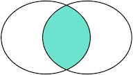
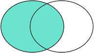

# 目录
1. 数据库基本概念
2. 数据库基本操作

## 数据库基本概念
### 表

- 表头(header): 每一列的名称;
- 列(col): 具有相同数据类型的数据的集合;
- 行(row): 每一行用来描述某条记录的具体信息;
- 值(value): 行的具体信息, 每个值必须与该列的数据类型相同;
- 键(key): 键的值在当前列中具有唯一性。

|姓名 |性别 |年龄|班级号|
|---|---|---|---|
|	小明|	M|	9|201|
|	小红|	F|	8|203|
|	小军|	M|	8|202|
|	小白|	F|	9|203|

如表中所示：该表就是一个关系，一共有姓名、性别和年龄三个属性，一共四条数据。

### 主键
对于关系表，有个很重要的约束，就是任意两条记录不能重复。不能重复不是指两条记录不完全相同，而是指能够通过某个字段唯一区分出不同的记录，这个字段被称为**主键**。

比如说我们想要找到特定的一行数据，比如上面学生小明的数据，这时我们自然而然会想到如果把主键设为小明，
就可以通过查询“小明”找到对应的记录。但是这样一来，同名的学生就无法存储到这张关系表中。

所以，选取主键的一个基本原则是：**不使用任何业务相关的字段作为主键。**

常见的可作为id字段的类型有：
- **自增整数类型**：数据库会在插入数据时自动为每一条记录分配一个自增整数，这样我们就完全不用担心主键重复，也不用自己预先生成主键；
- **全局唯一GUID类型**：使用一种全局唯一的字符串作为主键，类似8f55d96b-8acc-4636-8cb8-76bf8abc2f57。GUID算法通过网卡MAC地址、时间戳和随机数保证任意计算机在任意时间生成的字符串都是不同的，大部分编程语言都内置了GUID算法，可以自己预算出主键。

目前，在任何大型工程级的项目中，我们都会采用GUID类型去标记某一行数据。这是因为不同的两张表自增整数类型都会一样，
如果以后想要批量操作的话会比较困难。而使用GUID类型则不会出现这种状况。

### 外键
class_id|班级号   |班级人数|班主任|
|---|---|---|---|
|7a287948-6522-477c-a9b4-3cac38cabdf2|	201|30|	李老师|
|f41314c7-5cc8-4561-8c22-1b9c03070160|	202|28|	王老师|
|7639efc7-ffe8-4d7d-895c-1afa6965b001|	203|31|	孙老师|
|c5594c91-f853-46e4-94a3-35946f13566d|	204|29|	程老师|

现在我们引入一张新表，学生表和班级表分别记录了有关每个学生的个人信息和每个班级的详细情况。
但是我们如果想要查小明的班主任是谁，应该怎么办呢？接下来我们引入外键的概念。

由于一个班级可以有多个学生，在关系模型中，这两个表的关系可以称为“一对多”，即一个**classes**的记录可以对应多个**students**表的记录。
为了表达这种一对多的关系，我们需要在**students**表中加入一列class_id，让它的值与classes表的某条记录相对应：

|students_id|姓名 |class_id|性别 |年龄|班级号|
|---|---|---|---|---|---|
|b0288ff3-c82b-44a0-8445-f94a7c71d12d|	小明|7a287948-6522-477c-a9b4-3cac38cabdf2|	M|	20|201|
|b2e56f7e-224a-4703-aab9-fce3bb225714|	小红|7639efc7-ffe8-4d7d-895c-1afa6965b001|	F|	21|203|
|0bf3aef3-e3b1-46f7-9f08-9a305cb69c7c|	小军|f41314c7-5cc8-4561-8c22-1b9c03070160|	M|	23|202|
|0dc861e9-dfb0-4d14-97d1-0d1fa9aa598f|	小白|7639efc7-ffe8-4d7d-895c-1afa6965b001|	F|	20|203|

这样，我们就可以根据class_id这个列直接定位出一个students表的记录应该对应到classes的哪条记录。

例如：
- 小明的class_id为7a287948-6522-477c-a9b4-3cac38cabdf2，因此对应的**classes**表的记录是id=7a287948-6522-477c-a9b4-3cac38cabdf2的201班，
班主任为李老师。

在students表中，通过class_id的字段，可以把数据与另一张表关联起来，这种列称为**外键**。

## 数据库基本操作（MySQL）
数据库基本操作是通过sql(structure query language)语句进行的，下面我们介绍如何用sql语句进行操作数据库。
**注意：sql语句不区分大小写**
### 创建、删除、选择数据库
```sql
create database students;       #新建students数据库
drop database students;         #删除students数据库
use students;                   #使用students数据库
```

### 创建数据表
创建MySQL数据表需要以下信息：
- 表名
- 表字段名
- 定义每个表字段

语法如下：
```sql
CREATE TABLE table_name (column_name column_type);
```

#### 常用数据类型
- 数值类型（TINYINT, INTEGER, FLOAT, DOUBLE, DECIMAL）
- 日期和时间类型（DATE, DATETIME）
- 字符串类型（CHAR, VARCHAR, TEXT）

#### 常用约束
- unique 唯一性约束
- not null 非空约束
- primary key 主键约束
- foreign key 外键约束
- default 默认
- check check约束

#### 实操案例
要求：建立前文中提到的**students**表和**classes**表。

学生表：
- student_id：主键
- name：非空
- class_id：外键，指向**classes**表
- gender：默认男
- age：确保输入的都在18岁以上
- class_num

班级表：
- class_id：主键
- class_num
- student_quantity：确保输入的都在不小于0
- teacher_in_charge：非空

```sql
create table if not exists `classes`(
    `class_id` varchar(50) primary key ,
    `class_num` varchar(10),
    `student_quantity` tinyint check ( student_quantity >= 0),
    `teacher_in_charge` varchar(10) not null
);

create table if not exists `students`(
    `student_id` varchar(50) primary key,
    `name` varchar(10) not null ,
    `class_id` varchar(50),
    `gender` varchar(2) default 'M',
    `age` tinyint check ( `age` >= 18 ),
    `class_num` varchar(10),
    foreign key (class_id) references classes(class_id)
);
```

### 插入数据
语法如下：
```sql
INSERT INTO table_name ( field1, field2,...fieldN )
                       VALUES
                       ( value1, value2,...valueN );
```
class_id|班级号   |班级人数|班主任|
|---|---|---|---|
|7a287948-6522-477c-a9b4-3cac38cabdf2|	201|30|	李老师|
|f41314c7-5cc8-4561-8c22-1b9c03070160|	202|28|	王老师|
|7639efc7-ffe8-4d7d-895c-1afa6965b001|	203|31|	孙老师|
|c5594c91-f853-46e4-94a3-35946f13566d|	204|29|	程老师|

下面我们依次插入classes的四条数据：
```sql
create table if not exists `classes`(
    `class_id` varchar(50) primary key ,
    `class_num` varchar(10),
    `student_quantity` tinyint check ( student_quantity >= 0),
    `teacher_in_charge` varchar(10) not null 
);

insert into classes (class_id, class_num, student_quantity, teacher_in_charge)
            values 
            ('7a287948-6522-477c-a9b4-3cac38cabdf2','201',30,'李老师'),
            ('f41314c7-5cc8-4561-8c22-1b9c03070160','202',28,'王老师'),
            ('7639efc7-ffe8-4d7d-895c-1afa6965b001','203',31,'孙老师'),
            ('c5594c91-f853-46e4-94a3-35946f13566d','204',29,'程老师')
```

### 查找数据
我们可以准备如下数据，方便我们进行查找。

| **id** | **class_id** | **name** | **gender** | **score** |
|:------:|:------------:|:--------:|:----------:|:----------:|
| 1      | 1            | 小明       | M          | 90         |
| 2      | 1            | 小红       | F          | 95         |
| 3      | 1            | 小军       | M          | 88         |
| 4      | 1            | 小米       | F          | 73         |
| 5      | 2            | 小白       | F          | 81         |
| 6      | 2            | 小兵       | M          | 55         |
| 7      | 2            | 小林       | M          | 85         |
| 8      | 3            | 小新       | F          | 91         |
| 9      | 3            | 小王       | M          | 89         |

| **id** | **name** |
|:------:|:---------:|
| 1      | 一班        |
| 2      | 二班        |
| 3      | 三班        |
| 4      | 四班        |

#### 基本查询
```sql
select * from students; # 选取students表中所有的数据
select name, gender, age from students; # 选取students表中name列，性别列和年龄列
```

#### 使用where子句
```sql
# SELECT * FROM <表名> WHERE <条件表达式> # where语句基本语法
SELECT * FROM students WHERE score >= 80; # 选择students表中分数在80以上的同学
SELECT * FROM students WHERE score >= 80 AND gender = 'M'; # 选择students表中分数在80以上的男性同学
SELECT * FROM students WHERE score >= 80 OR gender = 'M'; # 选择students表中分数在80以上或者男性同学（两个条件满足任意一个即可）
SELECT * FROM students WHERE NOT class_id = 2; # 选择students表中class_id不为2的同学
SELECT * FROM students WHERE (score < 80 OR score > 90) AND gender = 'M'; # 可以使用and，or和not嵌套查询
```

#### 使用order by子句
简单的order by子句
```sql
SELECT id, name, gender, score FROM students ORDER BY score; # 对挑选出来的数据按分数这一列排序（默认升序）
SELECT id, name, gender, score FROM students ORDER BY score DESC; # DESC可以让数据从高到低降序排列
SELECT id, name, gender, score FROM students ORDER BY score DESC, gender; # 表示先按score列倒序，如果有相同分数的，再按gender列排序
```

如果有WHERE子句，那么ORDER BY子句要放到WHERE子句后面。
```sql
SELECT id, name, gender, score
FROM students
WHERE class_id = 1
ORDER BY score DESC;
```

#### 连接查询
例如，我们想要选出students表的所有学生信息，可以用一条简单的SELECT语句完成：
```sql
select s.id, s.name, s.class_id, s.gender, s.score from students s;
```
但是，假设我们希望结果集同时包含所在班级的名称，上面的结果集只有class_id列，缺少对应班级的name列。

现在问题来了，存放班级名称的name列存储在classes表中，只有根据students表的class_id，找到classes表对应的行，再取出name列，就可以获得班级名称。
```sql
SELECT s.id, s.name, s.class_id, c.name class_name, s.gender, s.score
FROM students s
INNER JOIN classes c
ON s.class_id = c.id;
```

注意INNER JOIN查询的写法是：

- 先确定主表，仍然使用FROM <表1>的语法；
- 再确定需要连接的表，使用INNER JOIN <表2>的语法；
- 然后确定连接条件，使用ON <条件...>，这里的条件是s.class_id = c.id，表示students表的class_id列与classes表的id列相同的行需要连接；
- 可选：加上WHERE子句、ORDER BY等子句。

除了inner join外，还有left join，right join和outer join，区别如下：
- 我们把tableA看作左表，把tableB看成右表，那么INNER JOIN是选出两张表都存在的记录：



- LEFT OUTER JOIN是选出左表存在的记录：



- RIGHT OUTER JOIN是选出右表存在的记录：


- FULL OUTER JOIN则是选出左右表都存在的记录：


注意：采取除inner join外其余的三种join方式均会产生很多null值，需要谨慎使用。

### 更新数据

#### update语句
update语句基本语法如下：
```sql
# UPDATE <表名> SET 字段1=值1, 字段2=值2, ... WHERE ...;
```
一些例子：
```sql
UPDATE students SET name='小张', score=66 WHERE id=1; # 更新一条记录
UPDATE students SET name='小牛', score=77 WHERE id>=5 AND id<=7; # 更新多条记录
UPDATE students SET score=score+10 WHERE score<80; # set语句可以是表达式
UPDATE students SET score=100 WHERE id=999; # 如果没有匹配到任何记录，UPDATE语句不会报错，也不会有任何记录被更新
```

#### delete语句
delete语句基本语法如下：
```sql
# DELETE FROM <表名> WHERE ...;
```
delete语句和update语句十分类似，下面是一些例子：
```sql
DELETE FROM students WHERE id>=5 AND id<=7;
DELETE FROM students WHERE id=999;
DELETE FROM students; # 不带WHERE条件的DELETE语句会删除整个表的数据，需要小心
```