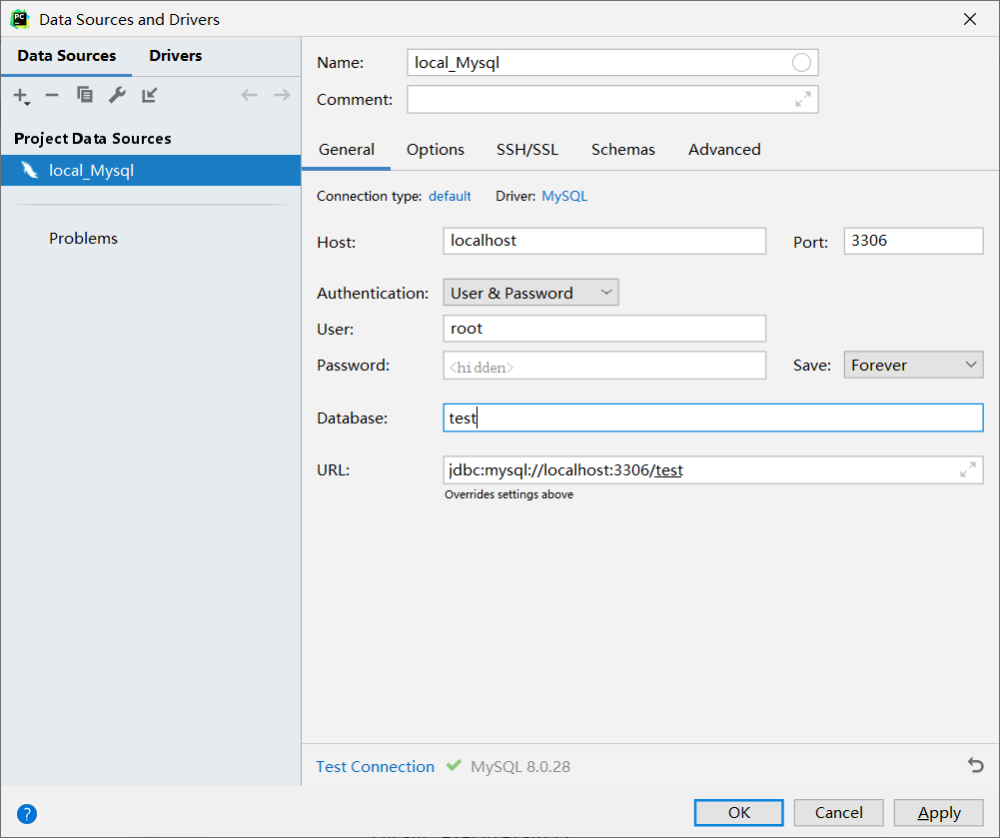
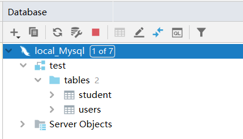
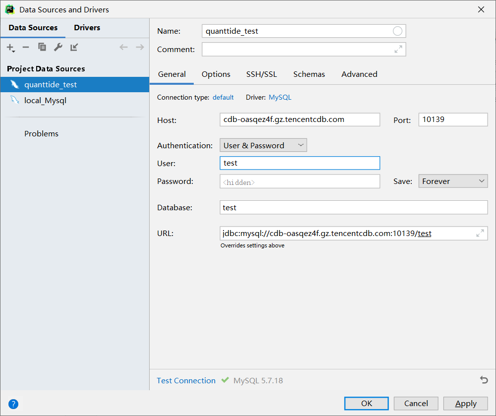
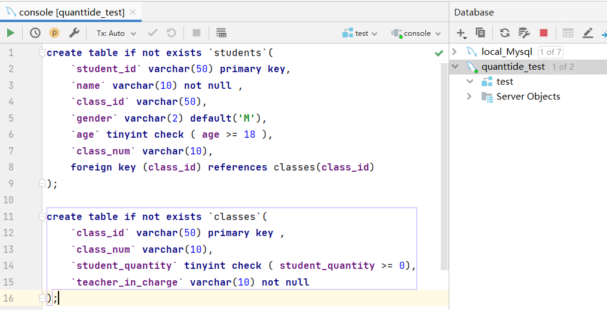
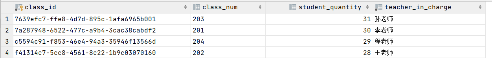

# 目录
- 安装PyMySQL
- 连接MySQL数据库
- 进行数据库有关操作

## 安装PyMySQL
可以直接使用pip命令安装：
```pycon
pip install pymysql
```
如果安装速度太慢，可以换清华的镜像源：
```pycon
pip install -i https://pypi.tuna.tsinghua.edu.cn/simple pymysql
```
另外，顺便说一句，pymysql十分的简单，只要你会sql语句就能通过python对mysql数据库进行操作。
附上官方文档地址：https://pypi.org/project/PyMySQL/

## 连接MySQL数据库
为了能够方便我们对数据进行操作，我们需要看到数据库的真实存储情况，下面以Pycharm为例讲解怎么连接到mysql数据库。
本教程采用的是Pycharm 2021 专业版，与多数社区版不同的是专业版安装的时候就有Database工具。
**（如果您使用的是社区版，只需要安装database navigator插件即可使用数据库功能，大致配置流程相似。）**
下面我们以连接到本地MySQL数据库为例。

### 连接到本地MySQL数据库
我们在Pycharm的工具栏中依次找到View->Tool Windows->Database，在弹出来的database工具中左上角找到New添加数据源，
在Data Source中我们选中MySQL，这样会打开配置界面如下：



在Name栏填上你想取的名字（随意），如果是本地数据库，那么Host就是本地localhost，Port值mysql是默认使用3306端口号的，
只要你安装的时候不乱改默认端口号一般都是3306。这里我采用user&password验证方式，因为我当时在本地mysql数据库建的时候就是使用的该验证方式，
（其中root是权限最高的用户），选中我们想要操作的数据库（没有建可以留空），这时我们填入的信息就好了。

在填好后，我们点击Test Connection，这时会提醒你安装mysql driver，这个是使得pycharm能够连接mysql数据库，按照pycharm提示安装好就可以。
配置好之后点击ok，连接数据库成功！



### 连接到云数据库
连接云数据库的操作与上述类似，将Host换成云数据库的url地址（本教程使用的是腾讯云数据库），Port换成对应的端口号，
安装好mysql driver后即可连接。



## 进行数据库有关操作
### 用Mysql console进行操作
打开quanttide_test数据源的console，输入我们上一讲中的建表语句，点击运行。



附上源码：
```sql
create table if not exists `courses`(
    `course_id` varchar(50) primary key ,
    `course_num` varchar(10),
    `student_quantity` tinyint check ( student_quantity >= 0),
    `teacher_in_charge` varchar(10) not null
);

create table if not exists `students`(
    `student_id` varchar(50) primary key,
    `name` varchar(10) not null ,
    `course_id` varchar(50),
    `gender` varchar(2) default 'M',
    `age` tinyint check ( `age` >= 18 ),
    `course_num` varchar(10),
    foreign key (course_id) references courses(course_id)
);

insert into courses (course_id, course_num, student_quantity, teacher_in_charge)
            values
            ('7a287948-6522-477c-a9b4-3cac38cabdf2','201',30,'李老师'),
            ('f41314c7-5cc8-4561-8c22-1b9c03070160','202',28,'王老师'),
            ('7639efc7-ffe8-4d7d-895c-1afa6965b001','203',31,'孙老师'),
            ('c5594c91-f853-46e4-94a3-35946f13566d','204',29,'程老师')
```

然后继续插入一些数据（第二讲中的courses表），成功插入后，我们查询一下现在courses表中的数据。

```sql
select * from courses;
```

这是在pycharm的service中我们就可以看到输出的结果：



### 使用python脚本进行操作
如果仅仅在pycharm里面使用pycharm的console有一定的局限性，我们希望能直接通过python脚本进行数据分析数据处理。
言归正传，我们讲解一下pymysql库的使用。

#### 连接数据库
使用pymysql里面的connect方法返回一个connection对象，我们需要提供的参数有host，port，user，
password和database名，具体如下：
```python
import pymysql

if __name__ == '__main__':
    connection = pymysql.connect(host='cdb-oasqez4f.gz.tencentcdb.com',
                                 port=10139,
                                 user='test',
                                 password='j78>=mVOPJJQo_c$',
                                 database='test')
```

#### 用sql语句进行插入操作
```python
with connection:
    with connection.cursor() as cursor:
        sql = 'insert into students(student_id, name, course_id, gender, age, course_num) VALUES  ("b0288ff3-c82b-44a0-8445-f94a7c71d12d", "小明", "7a287948-6522-477c-a9b4-3cac38cabdf2", "M", 20, "201");'
        try:
            cursor.execute(sql)
            connection.commit()
        except:
            connection.rollback()
```
我们用with管理上下文，这样可以自动帮助我们关掉connection连接，不然我们需要手动输入：
```python
connection.close()
```
我们可以新建一个游标cursor，目的是帮助我们读取sql语句。但是我们对数据进行操作之后，这个数据并没有马上写入数据库，
我们需要将修改的数据commit才真正改变了数据库。另外，如果中途发生网络不良或者意外情况，我们需要及时rollback，
将我们进行的操作回退回来。

#### 用sql语句进行查找
```python
with connection.cursor() as cursor:
     sql = 'select * from courses'
     cursor.execute(sql)
     results = cursor.fetchall()
     print(results)
```
游标cursor的方法fetchall()能够返回查到的所有结果，我们可以看看找到了哪些：
```pycon
(('7639efc7-ffe8-4d7d-895c-1afa6965b001', '203', 31, '孙老师'), ('7a287948-6522-477c-a9b4-3cac38cabdf2', '201', 30, '李老师'), ('c5594c91-f853-46e4-94a3-35946f13566d', '204', 29, '程老师'), ('f41314c7-5cc8-4561-8c22-1b9c03070160', '202', 28, '王老师'))

Process finished with exit code 0
```

#### 完整代码
```python
import pymysql

if __name__ == '__main__':
    connection = pymysql.connect(host='cdb-oasqez4f.gz.tencentcdb.com',
                                 port=10139,
                                 user='test',
                                 password='j78>=mVOPJJQo_c$',
                                 database='test')
    with connection:
        with connection.cursor() as cursor:
            sql = 'insert into students(student_id, name, course_id, gender, age, course_num) VALUES  ("b0288ff3-c82b-44a0-8445-f94a7c71d12d", "小明", "7a287948-6522-477c-a9b4-3cac38cabdf2", "M", 20, "201");'
            try:
                cursor.execute(sql)
                connection.commit()
            except:
                connection.rollback()

        with connection.cursor() as cursor:
            sql = 'select * from courses'
            cursor.execute(sql)
            results = cursor.fetchall()
            print(results)
```
