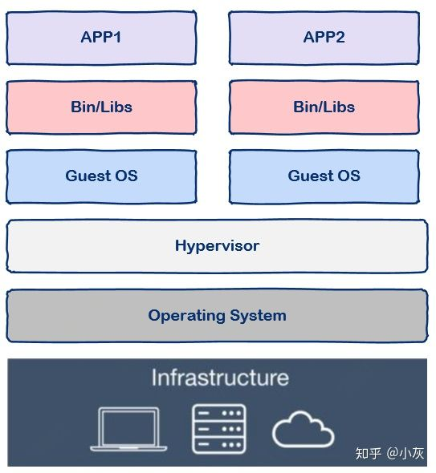
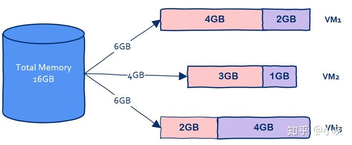
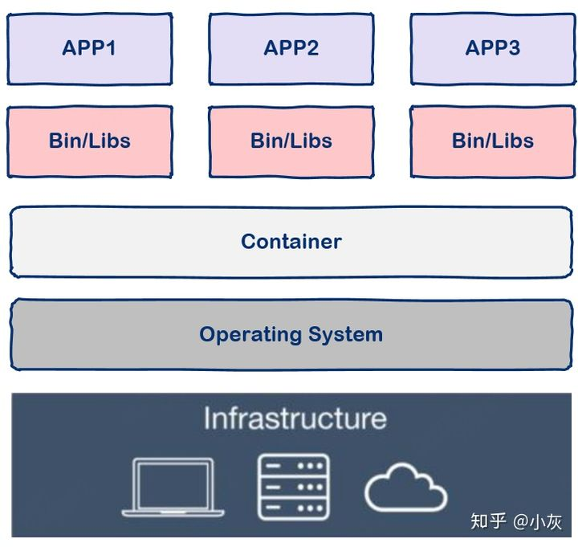
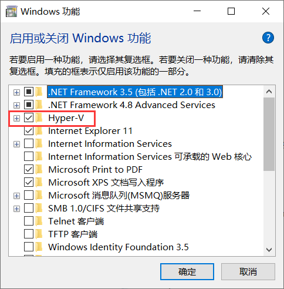
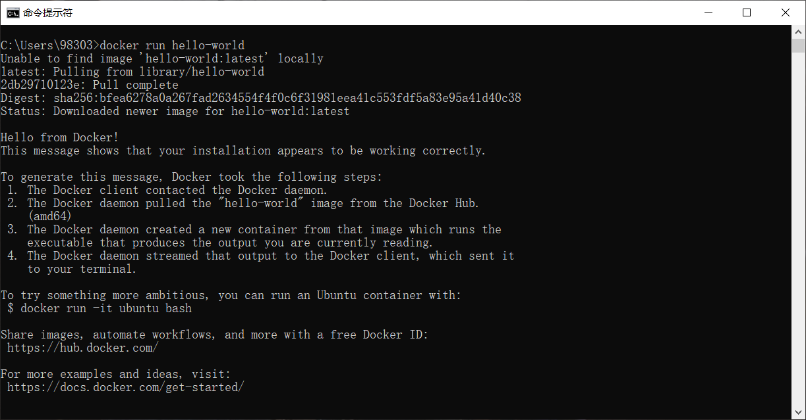
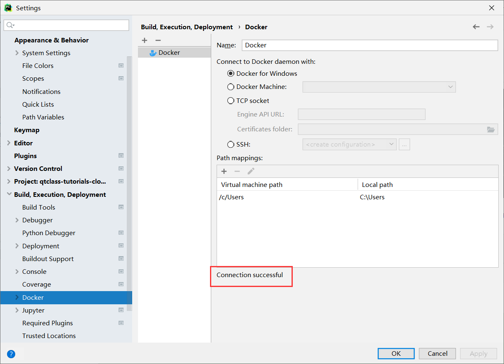
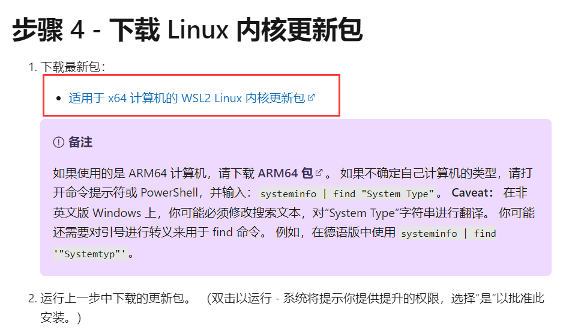

# 目录
1. Docker在什么情况下有用？
2. 基本概念
3. Docker安装下载（windows）
4. pycharm连接docker
5. 常见安装问题

## Docker在什么情况下有用？

现代软件开发的一大目的就是隔离，应用程序在运行时相互独立互不干扰，这种隔离实现起来是很不容易的，
其中一种解决方案就是使用**虚拟机技术**，通过将应用程序部署在不同的虚拟机中从而实现隔离。



但是这种方法有一个很大的缺陷，就是虚拟机会占用很大一部分内存。假设我有一台机器，16G内存，
需要部署三个应用，那么使用虚拟机技术可以这样划分：



在这台机器上开启三个虚拟机，每个虚拟机上部署一个应用，其中VM1占用2G内存，VM2占用1G内存，VM3占用了4G内存。

我们可以看到虚拟本身就占据了总共7G内存，因此我们没有办法划分出更多虚拟机从而部署更多的应用程序。
因此使用虚拟机会大大占用不必要的内存空间。

如果有一种技术可以让我们避免把内存浪费在“无用”的操作系统上岂不是太香？**容器**技术应运而生。



从图中我们可以看到容器更加的轻量级且占用的资源更少，与操作系统动辄几G的内存占用相比，容器技术只需数M空间，、
因此我们可以在同样规格的硬件上大量部署容器，这是虚拟机所不能比拟的。

## 基本概念

|  术语        | 名称  | 解释                               |
|------------|-----|----------------------------------|
| image      |  镜像 | Docker 镜像是用于创建 Docker 容器的模板      |
| container  | 容器  | 容器是独立运行的一个或一组应用，是镜像运行时的实体。       |
| registry   | 注册表 | Docker 仓库用来保存镜像，可以理解为代码控制中的代码仓库。 |
| repository | 制品库 |  不同版本的同类镜像仓库                     |

注意：
1. 一个镜像（image）可以生成多个容器（container），镜像相当于生成容器的模板
2. 应用程序是运行在容器里面的，容器是**动态**的，镜像是**静态**的
3. 最常见的registry是**Docker Hub**，相当于python的PyPI
4. 一个Docker Registry中可以包含多个仓库（Repository）；每个仓库可以包含多个标签（Tag）；每个标签对应一个镜像。
5. 通常，一个仓库会包含同一个软件不同版本的镜像，而标签就常用于对应该软件的各个版本。
我们可以通过 <仓库名>:<标签> 的格式来指定具体是这个软件哪个版本的镜像。如果不给出标签，将以 latest 作为默认标签。

## Docker安装下载（windows）
### 1、开启Hyper-v
1. 打开“应用和功能”页面（可以搜索栏搜索）
2. 单击“程序和功能”链接
3. 单击“启用或关闭Windows功能”
4. 确认Hyper-V和容器复选框已经被勾选，并单击确定按钮。



注：如果是windows家庭版，则需要额外下载Hyper-v，见后文”常见安装问题“。

### 2、下载docker desktop for windows

官方地址：https://hub.docker.com/editions/community/docker-ce-desktop-windows

下载完安装包后启动安装，按照提示完成安装。

注：如果在安装过程中要求更新linux内核，需要额外安装linux内核更新包，见后文”常见安装问题“

### 3、测试是否安装成功
打开cmd，运行以下代码：
```pycon
docker run hello-world
```



如果出现以上内容则代表安装成功！！

## pycharm连接docker
新建一个文件夹，用pycharm打开。File->Settings->Build,Execution,Deployment->Docker。
由于我们已经安装了docker desktop for windows，因此我们直接在对应复选框勾选，不需要另外配置了。



如上图所示，出现Connection Successful则代表连接成功。点击OK后即可连接。

连接后在下方会弹出来service工具，我们可以看到服务器（Docker），镜像（image），容器（container）等。

## 常见安装问题
### 安装Hyper-v
1. 将如下代码添加到记事本中，并另存为Hyper-V.cmd文件
```pycon
pushd "%~dp0"
dir /b %SystemRoot%\servicing\Packages\*Hyper-V*.mum >hyper-v.txt
for /f %%i in ('findstr /i . hyper-v.txt 2^>nul') do dism /online /norestart /add-package:"%SystemRoot%\servicing\Packages\%%i"
del hyper-v.txt
Dism /online /enable-feature /featurename:Microsoft-Hyper-V-All /LimitAccess /ALL
```
2. 找到Hyper-V.cmd文件图标，在右键菜单中点击：以管理员身份运行
3. 系统自动进行Windows命令处理，我们等待处理完成以后，【这个过程中不要关闭窗口或者关机】在最末处输入：Y，电脑自动重启，进行配置更新。
4. 电脑重启之后，在window管理工具中可以看到已经成功安装了Hyper-V。这样就可以在不用重装专业版系统的情况下，使用Hyper-V虚拟机了。

### 安装linux内核更新包
下载地址：https://docs.microsoft.com/zh-cn/windows/wsl/install-manual

