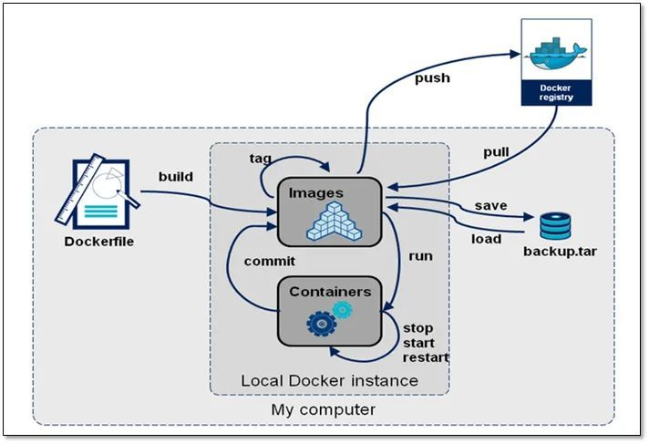
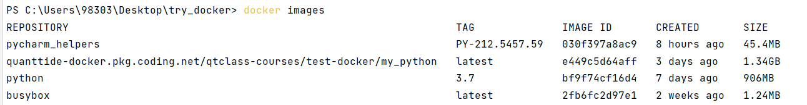
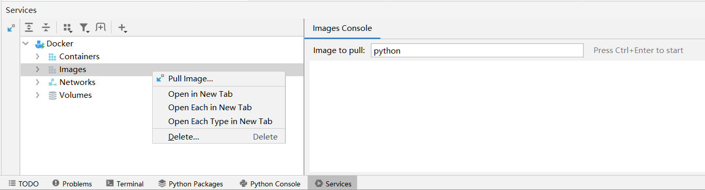
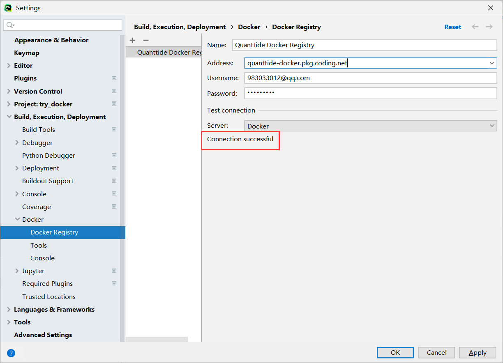
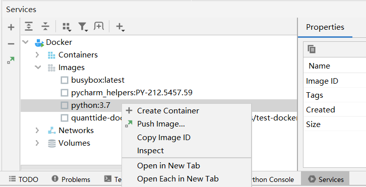
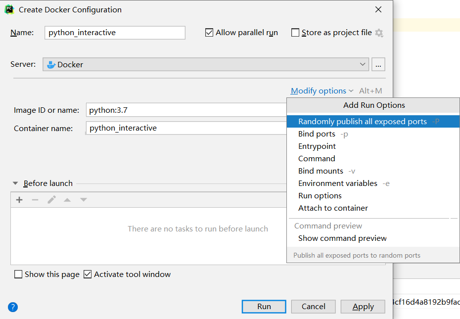
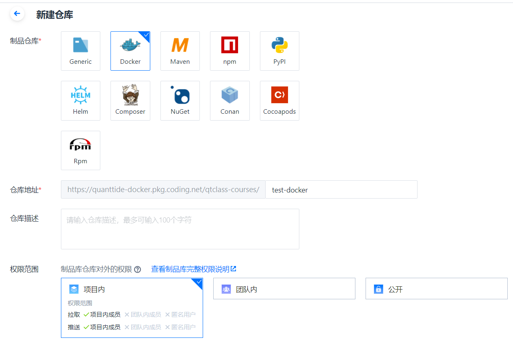
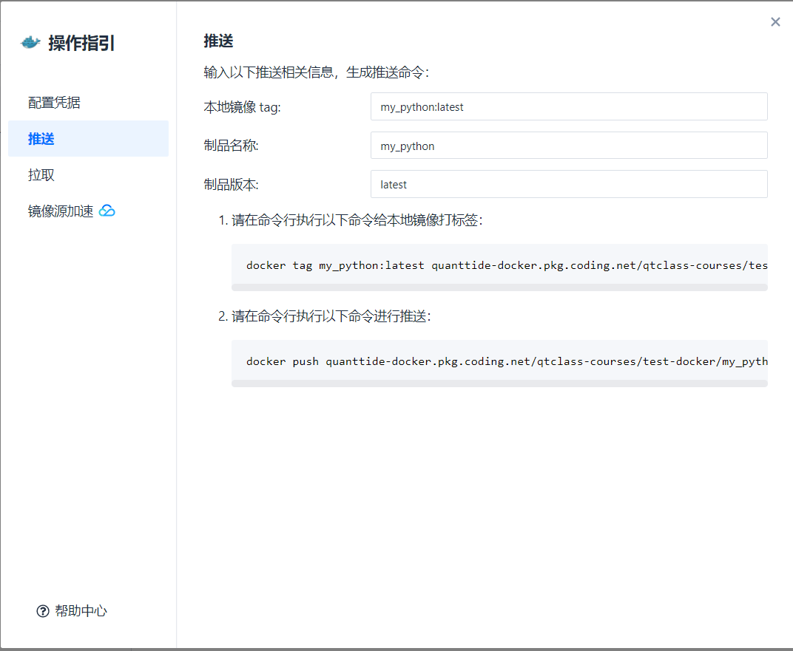

# 目录
1. 镜像的生命周期
2. 从制品库拉取镜像
3. 利用镜像生成容器
4. 用命令行制作镜像
5. 将镜像推送到制品库
6. 其他常用命令

## 镜像的生命周期
在了解具体操作之前，我们来看具体我们将会使用到哪些操作。



首先，容器是真正运行应用程序的东西，而镜像是用来创造容器的。生成镜像有三种方法：
- 从已有的制品库拉取（pull）镜像。默认的registry为Docker Hub，当然也可以从coding的docker制品库拉取。
- 利用脚本Dockerfile生成镜像（build）。Dockerfile文件记录了生成镜像的一些操作，比如该镜像继承哪个镜像（From），
该镜像作者是谁（Maintainer）等等。
- 利用.tar文件包生成镜像。有的人会将镜像打包成.tar压缩包，你只需要载入（load）就可以。
- 利用容器生成镜像（commit）。比如镜像A是没有安装任何第三方库的，利用A生成容器a后，我们对a进行操作，
比如想要安装pymysql去操作数据库，任务完成后我们想保留这个操作数据库的功能，这样我们用容器a生成镜像B，
这样镜像B生成的所有容器都有操作数据库的功能了。

其次，镜像生成之后，我们便可以用该镜像生成容器（run），这样我们便进入了容器内部，可以通过命令行让容器运行某个应用程序。
也可以随时让容器停止，开始或者重启。

在对容器进行不断操作的时候，我们可能想保留这样那样的一些特性，我们会不断映射成镜像A,B,C,D...这些镜像是同一类型的，
但是功能却有差异，如何区分呢？这样我们就有了标记（tag）。当我们去docker registry拉取镜像的时候，
我们不但要确定镜像名（如python），也要确定标记（如3.7），如果省略标记，则默认为最新（latest）

最后，我们想要将镜像与他人分享协同。我们可以推送（push）到docker制品库（如Docker Hub或者Coding的docker制品库），
或者保存为tar文件与他人分享。

## 从制品库拉取镜像
### 命令行命令
```pycon
docker pull python          # 拉取名为python的镜像（未指明版本则默认最新版本）
docker pull python:3.7      # 拉取名为python，版本为3.7的镜像
```
从制品库拉到镜像后，我们可以通过以下命令查看本地镜像列表：
```pycon
docker images
```
这时能看到本地镜像中已经多了python:3.7这个镜像了。



### pycharm操作



images -> 右键pull images，在右侧输入你想获得的镜像名:版本名

### 配置镜像源（以coding为例）
File -> Settings -> Build, Execution, Deployment -> Docker -> Docker registry



coding提供了三种制品库认证方式，个人令牌，用户名密码，项目令牌。其中个人令牌是官方推荐的，
可以追踪不同人下载的次数等信息。但是pycharm配置只支持用户名密码一种方式，
个人令牌的配置方法需要命令行输入，感兴趣的同学们可以自己研究。

## 利用镜像生成容器
### 命令行命令
```pycon
docker run [OPTIONS] IMAGE [COMMAND] [ARG...]
```
上面是利用镜像生成容器的命令格式，具体而言有以下常用选项:

```pycon
docker run -it python:3.7       # -it代表交互式命令窗口
docker run -it python:3.7 /bin/bash     # /bin/bash表示打开bash窗口
```
注：如果打开运行容器后**没有后台进程**（即没有应用程序在运行），那么容器会**自动退出**。因此，
对于初学者而言，加-it是必要的，可以与bash窗口进行交互，避免容器自动退出。

### pycharm操作



点击Create Container，然后会弹出运行配置页面:



这个页面中，参数有以下含义：
- Name：指的是该配置的名字。比如我打算弄一个交互式python控制台的配置，还有一个非交互式python控制台的配置，
那么为了区分，我可以用python_interactive和python_non_interactive两个配置去区分。
后面我们实际使用的时候便能清晰感知。
- Allow parallel run：是否允许多容器并行运行。在选否的时候在当前有容器在运行的时候，如果你打算运行这个镜像，
那么会有提示要求你停止目前正在运行的容器。
- Store as project file：是否生成配置文件。选择是的时候会在当前工作目录生成配置文件，你可以将此配置文件和其他人共享。
- Image ID or Name：指定所用的镜像。
- Container name：指定所生成容器的名字。如果留空则docker自动生成。
- Modified options：这里会有很多额外选项。常用的为Run options。**比如在里面填入-it，就会生成交互式容器。**
- Before launch：指在生成容器之前需要做什么。

完成配置后点击Apply，再点击Run即可生成运行的容器。

## 用命令行制作镜像（以python安装第三方库为例）
首先进入python:3.7的容器内：
```pycon
docker run --name python_interactive -it python:3.7 /bin/bash
```
然后就可以下载第三方包了：
```pycon
pip install pandas
pip install scipy
```
完成之后，我们可以进入python控制台，看看是否安装成功：
```pycon
python
```
```pycon
import pandas
```
如果发现不报错即为安装成功，这时退出python控制台：
```pycon
exit()
```
然后退出bash命令行：
```pycon
exit
```
然后我们想用这个已经安装了第三方库的容器生成镜像，使用以下命令：
```pycon
docker commit python_interactive my_python:latest
```
即可发现我们的images列表中多了my_python这个镜像。此时my_python生成的任何容器都含有pandas, scipy这两个库了。

## 将镜像推送到制品库（以coding为例）
在Coding上对应项目先新建一个制品仓库：



然后在制品仓库的仓库管理中，我们发现镜像列表是空的，我们点击操作指引：



按顺序将其中的指令复制粘贴到命令行，运行后即可成功推送到我们coding上的Docker registry

## 其他常用命令
```pycon
docker images       # 查看镜像列表
docker ps -a        # 查看容器列表
docker rmi 镜像名      # 删除镜像
docker rm 容器名       # 删除容器
```