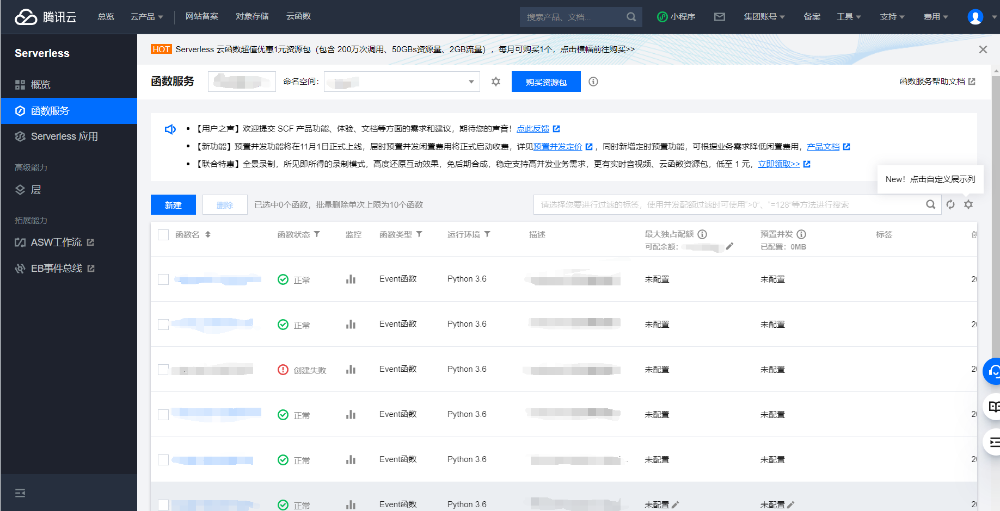

# 标准项目转换成函数计算项目

<!--
Metadata的title。
可以考虑不要，不一定需要渲染。
-->

## 概述

<!--
Metadata里的简介以说人话的方式表述。Metadata的数据不会在文章中渲染，所以在开头以说人话的方式说一遍。
-->

本讲的教学目标是入门函数计算。

本讲的教学思路是讲述把一个Python普通模块改造成函数计算并部署的过程。

1. 在`main`函数改为`main(event, context)`格式
2. 通过云函数控制台上传。
3. 运行云函数测试。

本讲的预期效果是让学习者发现它真的很简单，而且可以干很多事情，被激发了继续学习的兴趣。

# 一、函数计算简介

这里比较建议给读者一个思考的出发点，建议是一个具体的疑问。
本地很大，本地操作不了在云上跑
假设你在做一个项目，在网页上找50个10s视频解析他们的音频，然后输出，你通过爬虫存储解析，将图片下载到本地，做完了。但是如果你要解析50个1h的视频呢？100个1h的视频呢？...
#  没法跑
你的电脑跑不动这个多视频，你该怎么办呢？

有钱的人会买服务器来跑，但实际上大部分人买不起（）这么多服务器，或者不太需要这么多服务器，比如小微企业或者个人开发者，那他们该怎么解决这个问题呢？

有人发现了这个需求，为了解决这个问题，有钱的大佬买下大片的服务器，在无需购买和管理服务器的情况下运行代码，这就是无服务 Severless。

我们只需要上传核心代码到规定平台并设置代码运行的条件，即可在腾讯云平台上弹性、安全地运行代码。


# 二、创建一个云函数
#账号问题？
打开云函数服务控制台 <https://console.cloud.tencent.com/scf/list?rid=16&ns=default>

映入眼帘左边有一个深蓝色的窄框，右边有很大的白色框框，这个就是函数服务部分的页面啦，

在函数服务部分你可以看到你拥有的函数列表，也能够创建一个新函数。

我们来新建一个函数。点击屏幕中间偏左的“新建”按钮，接着会跳到一个新的页面。

如果你只是想要体验一下创建函数的过程的话，就在灰色小字“创建方式”的右边选“自定义创建"。
接着往下拉屏幕，会看到函数名称，因为确定函数之后不能再改名字，所以在这里把它改成你想要的名字，

再往下有一个白色的块左上角写着函数代码，在这里为了简便，我们选择提交方法为”在线编辑“，
往下会有一个类似IDE的界面


别急着把代码贴进去，我们输入的代码要改成IDE需要的样子

怎么改造呢？
我们先返回我们的代码中，按照步骤进行：

1.先添加主函数。如果你的函数没有主函数的话在函数末尾加一个主函数。

2.之后给主函数添加上`event、context`这两个参数。

3.给这两个参数赋上你需要的值，没有的话就赋上空值，即`event = {}` `context = {}`

这样我们就将函数改造完了，是不是很简单？


> 举个例子：
>```python
># 创建一个函数
>def Print():
>    print("Hello World!")
>```
>按照上面的步骤改造我们的函数：
>```python
># 改造成了云函数需要的样子
>def Print():
>    print("Hello World!")
>def main(event,context):
>    Print()
>```

然后我们把改好的代码复制粘贴到刚刚那个IDE界面。


接着还有很关键的一步，就是把IDE界面上面的小框框————”执行方法“改成**index.main**


这里解释一下，并不是所有的函数都要改成index.main，
**执行方法表示云函数从哪个文件中的哪个函数开始执行**，
这里我们的函数是从index文件的main函数开始执行，当然也可以按照你的情况改成你需要的样子。

接下来点下面的”完成“按钮，就创建完成啦！

# 三、测试云函数

跳转到新页面，观察页面。

函数配置部分你可以修改你的函数配置， 函数代码部分你可以测试你的函数并查看返回结果以及日志。

点击函数框面下方的测试便可以测试函数，查看返回结果。


根据你的函数返回的结果和日志修改代码，让其顺利运行。
#坑 怎么填充？
数据在外面 用测试模板

测试模板

创建必须新增册数模板，不能人为创建
event["a"]调用
数据较多把数据放到.josn,方括号， index字典形式
方括号event[“key”]进行调用


(这里针对不包括第三方库的代码，如果你的代码包含第三方库，[跳转到第三章Serverless_Framework](7_3_Serverless_Framework.md))


## 参考资料

<!--
在这里以相对规范的格式引用参考的文档等资料。
-->
