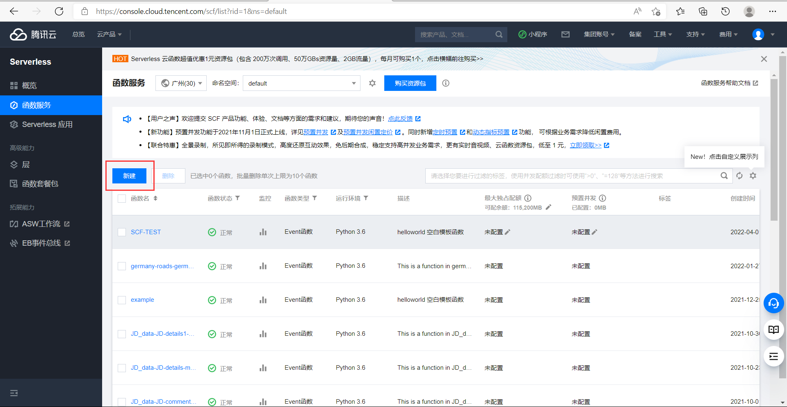
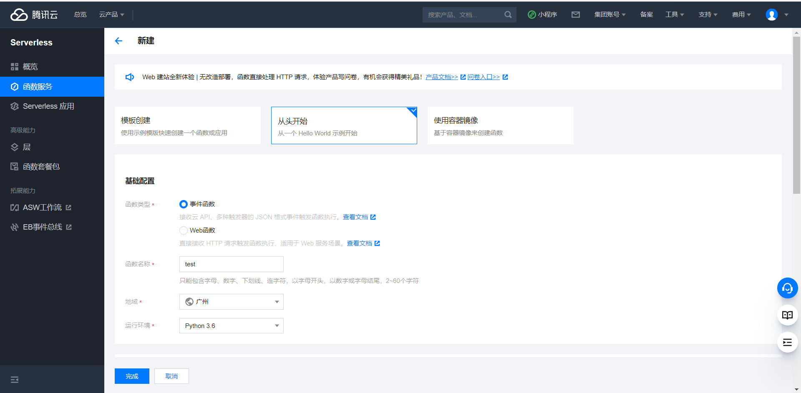
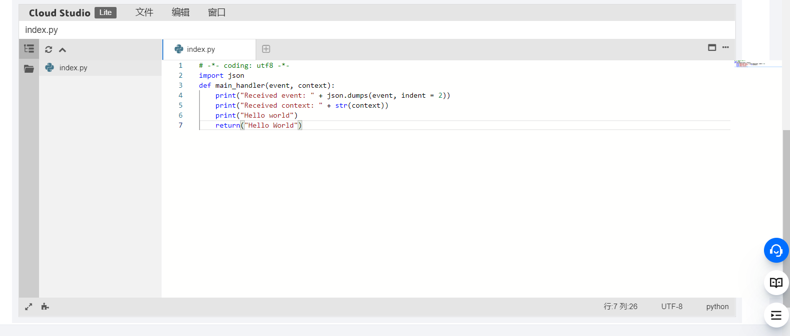
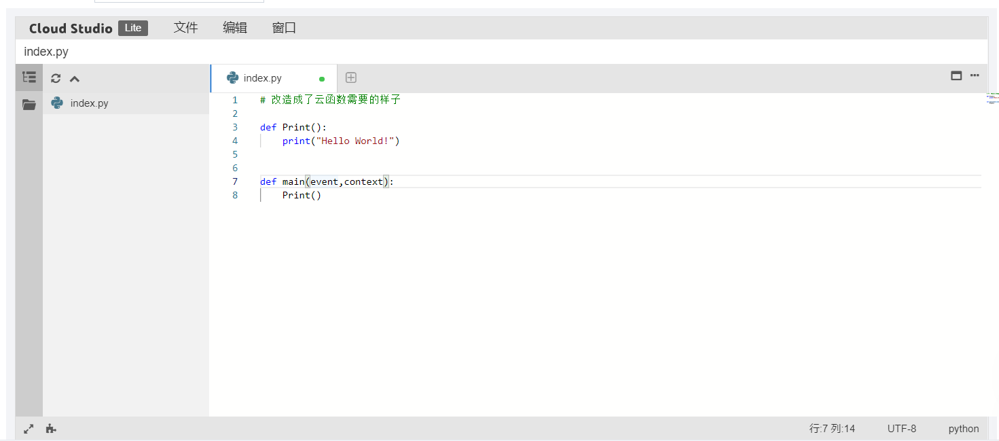
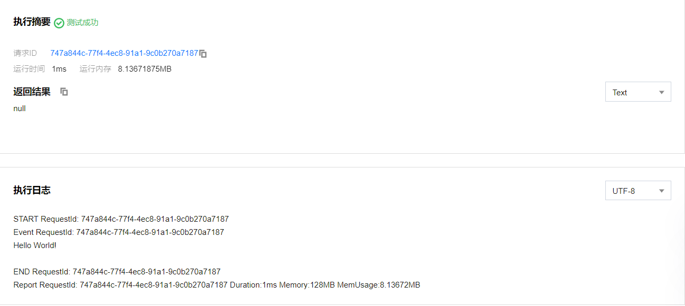

# 标准项目转换成函数计算项目

## 概述

本讲的教学目标是入门函数计算。

本讲的教学思路是讲述把一个Python普通模块改造成函数计算并部署的过程。

1. 在`main`函数改为`main(event, context)`格式
2. 通过云函数控制台上传。
3. 运行云函数测试。

# 一、函数计算简介
假设你在做一个项目，在网页上找50个10s视频解析他们的音频，然后输出，你通过爬虫存储解析，将图片下载到本地，做完了。但是如果你需要解析50个1h的视频呢？100个1h的视频呢？...

这时你发现了你的电脑跑不动这么多视频，你该怎么办呢？

有钱的人会买服务器来跑，但实际上大部分人买不起这么多服务器，或者不太需要这么多服务器，比如小微企业或者个人开发者，那他们该怎么解决这个问题呢？

有人发现了这个需求，为了解决这个问题，有钱的大佬买下大片的服务器，在无需购买和管理服务器的情况下运行代码，这就是无服务Severless。

我们只需要**上传核心代码**到规定平台并**设置代码运行的条件**，即可在腾讯云平台上弹性、安全地运行代码。

# 二、创建一个云函数

打开云函数服务控制台 <https://console.cloud.tencent.com/scf/list?rid=16&ns=default>



在函数服务部分你可以看到你拥有的函数列表，也能够创建一个新函数。
点击“**新建**”按钮，接着会跳到一个新的页面。



选择“从头开始”，接下来我们选择事件函数，给我们的函数取个新名字（以test为例），选择地域（默认是离你最近的服务器），
最后是运行环境（换为python3.6，因为支持比较新的编辑器模式）

接下来我们向下拖动，选择提交方法为“在线编辑”，执行方法为函数入口，先保持默认。



接下来我们需要把我们的代码改造成云函数格式。我们返回我们的代码中，按照步骤进行：

1. 先添加主函数。如果你的函数没有主函数的话在函数末尾加一个主函数。
2. 之后给主函数添加上`event、context`这两个参数。
3. 给这两个参数赋上你需要的值，没有的话就赋上空值，即`event = {}` `context = {}`

举个例子：
```python
# 创建一个函数
def Print():
    print("Hello World!")
```
按照上面的步骤改造我们的函数：
```python
# 改造成了云函数需要的样子
def Print():
    print("Hello World!")

    
def main(event,context):
    Print()
```

然后我们把改好的代码复制粘贴到刚刚那个IDE界面。



接着还有很关键的一步，就是把IDE界面上面的小框框————”执行方法“改成**index.main**


这里解释一下，并不是所有的函数都要改成index.main，
**执行方法表示云函数从哪个文件中的哪个函数开始执行**，
这里我们的函数是从index文件的main函数开始执行，当然也可以按照你的情况改成你需要的样子。

接下来点下面的”完成“按钮，就创建完成了。

# 三、测试云函数

跳转到新页面，观察页面。

- **函数配置**部分你可以修改你的函数配置
- **函数代码**部分你可以测试你的函数并查看返回结果以及日志。我们点击函数框面下方的测试便可以测试函数，查看返回结果。



我们可以看到测试成功，没有返回结果（我们没有指定return值），在下面的执行日志中我们可以看到输出了我们想要的结果：**Hello World!**

# 参考资料
