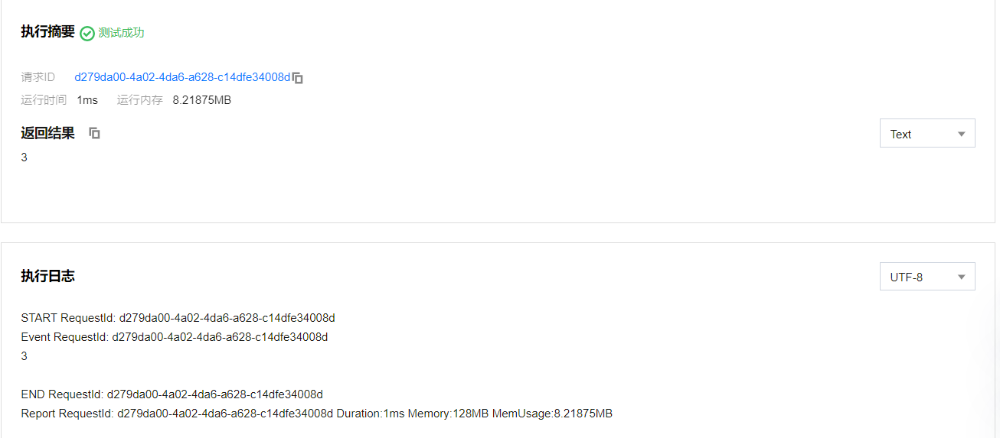
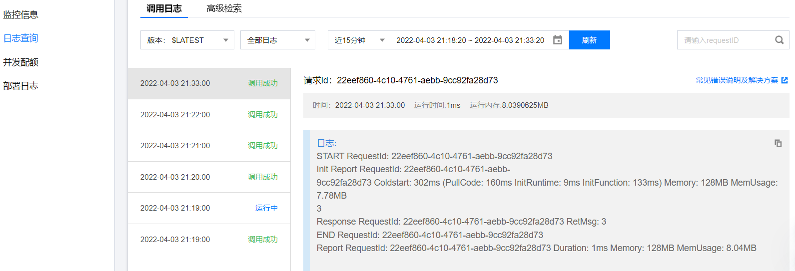
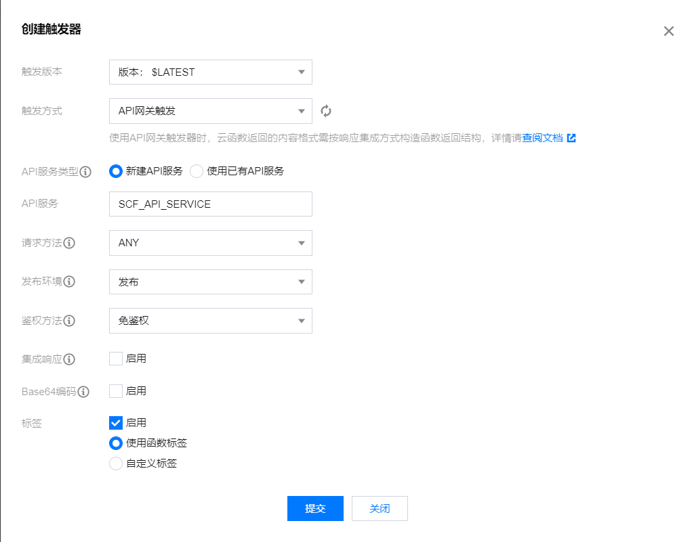
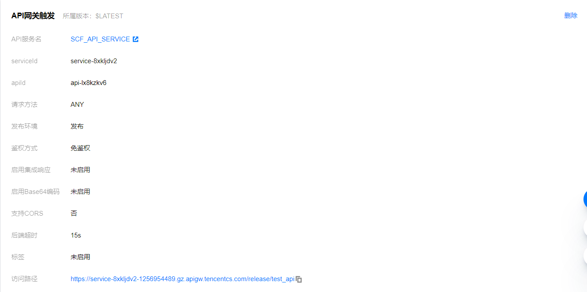

# 函数计算

##本节目标

本讲的教学目标为：

1. 了解什么是事件函数和触发器；
2. 通过Input-Process-Output的模型了解触发器和事件函数之间的关系。

## 一、简述
Python的基本函数包括三个部分：入参、函数本身和返回值，分别对应输入（input）、处理（process）和输出（output）。
定义一个基本函数后，会通过主程序去调用这个函数并输入参数，然后通过变量获取返回值。

函数计算的事件函数就对应着处理（process）这部分，而触发器就类似于在外部调用事件函数的主程序，既输入参数（input），又获取事件函数的返回值
（output）。

## 二、事件函数
```python
def Print():
    print("Hello World!")


def main(event,context):
    Print()
```

在第一讲中，函数被改造成了如上图所示，这是一个简单的事件函数。接下来我们把该函数修改成如下所示。

```python
# -------index.py-------
def Print(a):
    print(a)

    
def main(event,context):
    a = event["key1"]
    b = event["key2"]
    Print(a + b)
    return a + b
```

## 1. 执行方法
**执行方法**是指调用事件函数的入口。在第一讲中，一般会把程序执行的起点函数，即主函数作为事件函数进行改造。
在如下图所示划红线地方，执行方法的输入格式是`{主函数所在代码文件名}.{主函数名}`。


假设函数文件名是`index.py`, 那么上面红线处应该输入`index.main`

## 2. 输入参数
事件函数的输入参数是固定不变的，只有`event`和`context`，并且顺序不能被调换。

### 2.1 参数event
`event`的数据类型是dict，作用是储存要被处理的输入数据。在事件函数中，通过类似键值对的方式调用要使用的数据。

以index.py的代码块为例，假设event的内容如下所示

```json
{
  "key1":1,
  "key2":2
}
```

那么，控制台会输出以下内容：

```pycon
3
```

### 2.2 参数context
`context`参数是云函数平台提供的，可以获取当前运行的云函数的信息，目前不会用到`context`参数。

### 2.3 测试模板
我们可以尝试用测试模板来改变输入的event和context参数。


点击**新增测试模板**，然后选择”**Hello World事件模板**“，给新增的测试模板取名后，enter。

这时工作目录下会出现一个json格式文件，我们在**context**一栏里面改好key1和key2的值：

```json
{
  "value": "test",
  "text": "Hello World事件模板",
  "context": {
    "key1": 1,
    "key2": 2
  }
}
```
这样就OK了，我们重新部署云函数后，测试，得到如下结果：



## 3. 返回值
事件函数的返回值，也就是return的内容，会以字典dict结构输出。但是能否被触发器捕捉到，取决于触发器的种类。


## 三、触发器
在简述部分，已经介绍了触发器的作用。接下来会主要介绍两种触发器，定时触发器和API网关触发器。

### 1. 定时触发器
定时触发器可以让你每隔一段固定时间，就执行一次云函数。

#### 定时触发器的设置
**第一步**：打开云函数控制台界面，在函数列表里单击需要配置触发器的云函数名称。然后，点击左栏的“触发管理”，就会显示如下界面。


**第二步**：点击“创建触发器”，在“创建触发器”弹窗中按照下图参数所示配置触发器，然后点击提交。


- **触发方式**选择定时触发。
- **触发周期**为了方便我们看到效果，这里选择每1分钟触发一次。
- **附加信息**为是否需要传入额外的event信息，附加信息的内容将会封装成以下格式。
比如如果如上图所示，得到的event值则为：
```json
{
   "Type":"Timer",
   "TriggerName":"EveryDay",
   "Time":"2022-04-3T11:49:00Z",
   "Message":"{"key1":1, "key2":2}"
}
```
注意，我们的附加信息会被转为字符串格式存储到”Message“中，因此，我们需要修改我们的函数代码为以下格式：
```python
# -*- coding: utf8 -*-
import json
def Print(a):
    print(a)

    
def main(event,context):
    data = json.loads(event['Message'])
    a = data["key1"]
    b = data["key2"]
    Print(a + b)
    return a + b
```
做完之后，我们可以在日志查询模块看到我们的调用信息：



### 2. API网关触发器
API网关触发器比起定时触发器更加复杂，但是可以以字典结构接收事件函数的返回值。

#### API网关触发器的设置
**第一步**：打开“触发管理”，创建触发器。

**第二步**：按照下图参数所示配置触发器，然后点击提交。



* __触发版本__：与云函数的版本控制有关，直接选择”版本：$LATEST“
* __触发方式__：选择“API网关触发”
* __API服务__：可以选择已经创建的已有API服务，也可选择新建API服务用于绑定云函数。本例选择新建API服务并命名
* __请求方法__：是指API网关服务向云函数发起调用请求的方式，具体解释见触发器一章。本例使用”ANY“。
* __发布环境__：是指发布API服务的环境，依使用者情况而定，有”测试“、”发布“和”预发布“三种选项。本例使用”发布“。
* __鉴权方法__：是指API网关服务向云函数发送请求时的认证方式，有”免鉴权“（即无需认证）和”密钥对“两种方式。本例为方便测试，选择”免鉴权“。
* __集成响应__：关系到云函数发送给触发器的返回值的数据格式。若启用，则会返回整个HTTP响应；若不启用，则只返回HTTP响应的Body部分内容。选择不启用。
* __Base64编码__：若使用到二进制文件，则启用。这里关掉。

**第三步**：完成第二步后，触发管理界面就会多出一个触发器并显示其信息，如下图。



接下来我们需要改造我们的函数代码：
```python
# -*- coding: utf8 -*-
import json


def main_handler(event, context):
    data = json.loads(event['body'])
    a = data['key1']
    b = data['key2']
    return(a + b)
```

这样一个云函数就配置成功了。接下来我们可以在本地进行调用。

### 3. 如何查看触发器的触发状况
在本地pycharm新建项目，输入代码：
```python
import requests


url = 'https://service-8xkljdv2-1256954489.gz.apigw.tencentcs.com/release/test_api'
data = {"key1":1, "key2":2}
r = requests.post(url=url, json=data)
print(r.text)
```
代码中的url地址为触发器管理中API网关的访问路径。在这里我们用post方法去向API网关发送Http请求，
将我们需要传入的参数data也封装在Http请求里面，得到结果如下：
```python
3
```