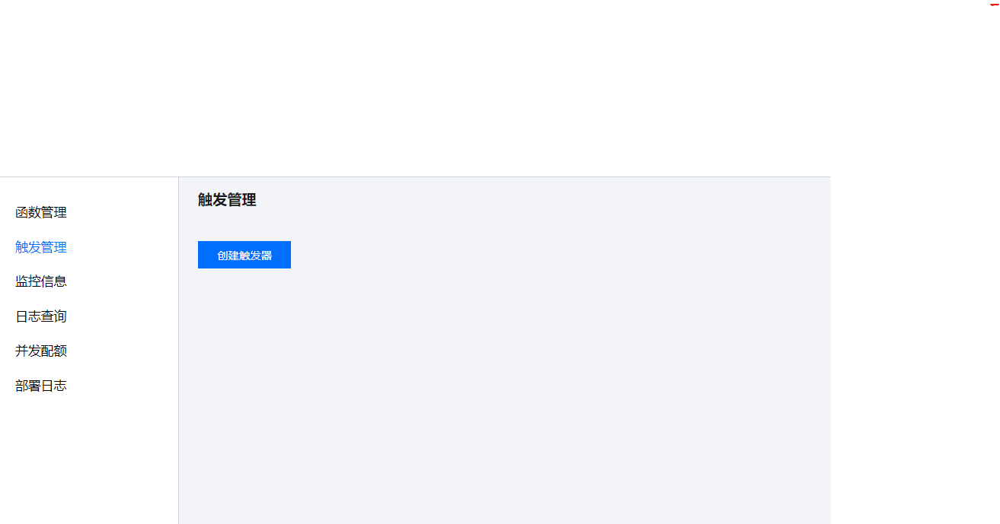

# 函数计算

概述
---
本讲的教学目标为：
1. 了解什么是事件函数和触发器；
2. 通过Input-Process-Output的模型了解触发器和事件函数之间的关系。

##一、简述
Python的基本函数包括三个部分：入参、函数本身和返回值，分别对应输入（input）、处理（process）和输出（output）。
定义一个基本函数后，会通过主程序去调用这个函数并输入参数，然后通过变量获取返回值。

函数计算的事件函数就对应着处理（process）这部分，而触发器就类似于在外部调用事件函数的主程序，既输入参数（input）,又获取事件函数的返回值
（output）。

##二、事件函数
```python
def Print():
    print("Hello World!")


def main(event,context):
    Print()
```
在第一讲中，函数被改造成了如上图所示，这是一个简单的事件函数。然后对其函数内容作进一步修改成如下所示。
```Python
# -------index.py-------
def Print(a):
    print(a)

def main(event,context):
    Print(event["key1"])
    Print(event["key2"])
    return event["key1"]
```
## 1.执行方法
执行方法是指调用事件函数的入口。在第一讲中，一般会把程序执行的起点函数,即主函数作为事件函数进行改造。
在如下图所示划红线地方，执行方法的输入格式是“{主函数所在代码文件名}.{主函数名}”。


假设函数文件名是index.py, 那么上面红线处应该输入“index.main”

## 2. 输入参数
事件函数的输入参数是固定不变的，只有event和context，并且顺序不能被调换。
### 2.1 参数event
event的数据类型是Dict，作用是储存要被处理的输入数据。在事件函数中，通过类似键值对的方式调用要使用的数据。

以index.py的代码块为例，假设event的内容如下所示
```json
{
  "key1":"Hello",
  "key2":"World"
}
```
那么，控制台会输出以下内容
```text
Hello
World
```
### 2.2 参数context
context参数是云函数平台提供的，可以获取当前运行的云函数的信息，目前不会用到context参数。

## 3. 返回值
事件函数的返回值，也就是return的内容，会以字典结构输出。但是能否被触发器捕捉到，取决于触发器的种类。例子index.py的返回值如果能被捕捉到，会以如下所示
呈现。
```json
{
  "key1": "Hello"
}
```

## 三、触发器
在简述部分，已经介绍了触发器的作用。接下来会主要介绍两种触发器，定时触发器和API网关触发器。

### 1.定时触发器
定时触发器是最简单的一种触发器。顾名思义，就是每间隔一段时间就会自动触发并调用事件函数的触发器。相比较于其他触发器，定时触发器不会接收事件函数的返回值，
也就是说，这种触发器没有output的部分，只适合于没有返回值的事件函数。

#### 1.1 定时触发器的设置
第一步：打开云函数控制台界面，在函数列表里单击需要配置触发器的云函数名称。然后，点击左栏的“触发管理”，就会显示如下界面。



第二步：点击“创建触发器”，在“创建触发器”弹窗中按照下图参数所示配置触发器，然后点击提交。

* 触发版本：与云函数的版本控制有关，直接选择”版本：$LATEST“
* 触发周期：设置触发器的间隔时间，有选项进行参考，如果已有的选项不能满足需求，可以选择“自定义触发周期”，然后用cron表达式设置。
* 附加信息：这里的内容会以字典形式传给事件函数的event参数。如果需要设置输入数据，可以在这里以键值对形式进行设置。

（这里会有一个图，但是我想用第一讲的函数来设置，所以打算等文稿草稿结束后补齐）

第三步：完成第二步后，触发管理界面就会多出一个触发器并显示其信息，如下图所示。可以在状态一栏，选择开启或者关闭触发器。
### 2. API网关触发器
API网关触发器比起定时触发器更加复杂，但是可以以字典结构接收事件函数的返回值。
##### API网关触发器的设置

